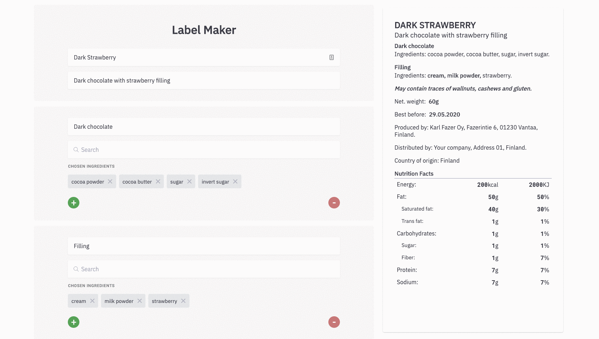

# Label maker

Tool for making low risk foor labels for small reselers.

## See [demo](https://hopeful-rosalind-652722.netlify.com/)

## Technologies

- React
- React-Router
- Redux

## Features

- minimizes the errors in creating food product labels such as:

  - typos
  - unmarked allergens
  - accidentally ommiting required information
  - and other common mistakes in creating labels.

- generates PDF document for printable stickers

## Future Features

- option of multiple languages tranlsation
- custom sticker size in PDF document

## Getting started

`> git clone https://github.com/antonijak/Label-maker.git`

`> cd 1.6.-Blog-App-Redux-and-Router`

`> yarn install`

`> yarn start`

